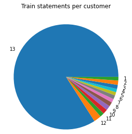
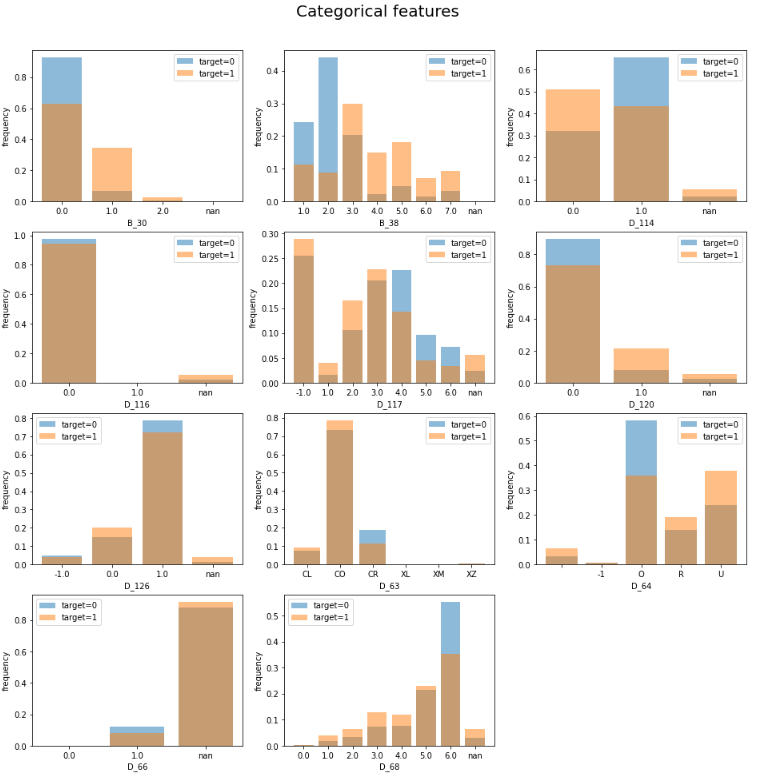

# Kaggle-American_Express

## 0. 대회 정보
- 대회 목표: American Express 카드사의 고객들이 향후 신용카드 잔액을 납부하지 않을 확률을 예측.
            120일 내에 납부하지 않을 경우 기본 이벤트로 간주함.(납부함 = 1, 납부안함 = 0)
- 주최기관: American Express
- 대회링크 (https://www.kaggle.com/competitions/amex-default-prediction/overview)

## 1. 데이터
- train data : 총 5531451 samples, 190 columns
- test data : 총 924621 samples, 190 columns
- 데이터 컬럼 설명 :  
                     D_* = Delinquency: 과실, 태만, 체납 -> 연체 변수  
                     S_* = Spend. 소비 변수  
                     P_* = Payment. 지급 변수  
                     B_* = Balance. 균형 변수  
                     R_* = Risk. 위험 변수
- [데이터 원본](https://www.kaggle.com/competitions/amex-default-prediction/data)
- 외부 데이터 사용여부 : 카드사 자체에서 제공한 데이터이기 때문에 연관성 있는 외부데이터 사용불가.
                 
## 2. EDA를 기반으로 한 전처리 방향
- EDA에서 우선적으로 확인할 수 있었던 점은 고객별로 가지고 있는 내역의 수가 1~13개 였다는 점이다.

    

- 13개의 내역을 가진 고객이 가장 많았다. 그렇기 때문에 훈련 데이터 용량을 줄이기 위해서 고객의 연속형 데이터  
  내역들을 취합해 평균, 표준편차, 최소,최대값 등의 통계내역들을 컬럼으로 추가해주었다. 
 
 
- 범주형 데이터는 B_30, B_38, D_114, D_116, D_117, D_120, D_126, D_63, D_64, D_66, D_68 총 11개다.
- 연속형 데이터와는 다르게 범주의 개수, 마지막 값, 고유값 개수 등의 컬럼으로 선정했다.

    

