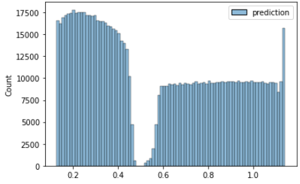

# Kaggle-American Express - Default Prediction

    

## 0. 대회 정보
- 대회 목표: American Express 카드사의 고객들이 향후 신용카드 잔액을 납부하지 않을 확률을 예측.
            120일 내에 납부하지 않을 경우 기본 이벤트로 간주함.(납부함 = 1, 납부안함 = 0)
- 주최기관: American Express
- 대회링크 (https://www.kaggle.com/competitions/amex-default-prediction/overview)

## 1. 데이터
- train data : 총 5531451 samples, 190 columns
- test data : 총 924621 samples, 190 columns
- 데이터 컬럼 설명 :  
                     D_* = Delinquency: 과실, 태만, 체납 -> 연체 변수  
                     S_* = Spend. 소비 변수  
                     P_* = Payment. 지급 변수  
                     B_* = Balance. 균형 변수  
                     R_* = Risk. 위험 변수
- [데이터 원본](https://www.kaggle.com/competitions/amex-default-prediction/data)
- 외부 데이터 사용여부 : 카드사 자체에서 제공한 데이터이기 때문에 연관성 있는 외부데이터 사용불가.
                 
## 2. EDA
- 본 경진 대회의 '목적'은 American Express 사의 카드를 사용하는 고객들이 상환 날짜가 연체된 비용을 지불 가능한지 예상하는 것이다. 먼저 train 셋에 있는 target columns을 이용하여
Default(연체)와 Paid(지불)의 비율을 알아 보았다.

    

- 먼저 인지하고 가야할 사항은 test 셋의 샘플수와 submission 셋의 샘플수가 일치하지 않는다는 점이다. submission 셋에는  
  중복되는 고객ID가 없고 test셋에는 존재한다.

- 원 그래프는 'customer-Id' 별 데이터의 갯수이다. 13개의 데이터가 가장 많았다. 이는 실제 1사람의 기록이 13명의 기록처럼 가공이 될 우려가 있다. 이를 방지하기 위해(모든 customer들의 연체금 지불 여부를 알기위해) 각 customer-Id 별 가장 마지막 거래만 뽑아서 데이터를 가공하였다.

    

- 190개의 columns을 Deliquency, Spend, Payment, Balance, Risk 등 5가지로 나눌 수 있었다. 데이터를 처리할 때 많은 데이터를 처리하는 것 뿐만 아니라 데이터의 결측치를 어떻게 해결해 주어야 할지도 프로젝트를 진행하는 데에 힘이 들었던 부분이다.

    

    

    

    

    

    

- 위는 각 columns 당 데이터 결측치의 정도를 알 수 있다. 막대 그래프의 세로 크기는 결측치가 아닌 정상 데이터의 양을 의미하고, 절반 이상의 칼럼에 결측치가 발생함을 알 수 있다.

### 2.1. 연속형 데이터
- 우선적으로 확인할 수 있었던 점은 고객별로 가지고 있는 내역의 수가 1~13개 였다는 점이다.
- 위 결과를 참고해 각 고객의 내역들을 취합해 평균, 표준편차, 최소, 최대값 등의 통계수치를 파생변수로 추가.
 

### 2.2. 범주형 데이터

    

- 범주형 데이터는 B_30, B_38, D_114, D_116, D_117, D_120, D_126, D_63, D_64, D_66, D_68 총 11개다. 
- 연속형 데이터와는 다르게 범주의개수, 마지막값, 고유값개수 들을 파생변수로 설정
- 문자형 데이터들은 모두 라벨인코더를 사용해 정수로 변경
 

### 2.3. 이진분류 데이터

    

- 범주형 데이터와 비슷하지만 1,0 또는 1,nan 으로 이루어진 컬럼이 있었다.
- 범주형과 마찬가지로 결측치가 상당한 부분을 차지하기에 새로운 unique값으로 할당
 

### 2.4. EDA 결론 & 전처리 
- 결측치를 처리하는 방향은 범주형(categorical),이진분류(binary) 데이터는 새로운 unique 값을 생성하기로 결정(결측치가 상당한 부분을 차지하기 때문에)
- 연속형(numeric) 데이터는 결측치를 0으로 대체.(비식별 데이터에서 연속형 결측치는 대부분 0을 나타내는 경우가 많음)
- train과 test의 customer id 가 중복되는 수가 존재하는 것을 확인했고 unique 값으로 확인했을때 label의 샘플수와 일치하는 것을 확인.
- 위 사실을 토대로 같은 id의 값들을 groupby로 묶어 평균을 내는 전처리를 선택
- 평균 하나로는 피처의 특성을 나타내기 힘들것 같아 min, max, std 등의 통계값을 파생변수로 생성
- 범주형 데이터는 평균을 낼 수 없기 때문에 동일 범주(customer id) 개수, 마지막 값, 고유값의 개수(nunique)들로 파생변수를 생성 
 

## 3. 모델 선정
- 우선 세가지 머신러닝 XGBoost, Catboost, LGBM 모델이 가장 많이 쓰이고 있었기 때문에 사용.

- 부트스트랩(Booststrap)
    - Random Sampling을 적용하는 방법. ex) 한 식자재마트에 들어 오는 상추의 신선도를 알고 싶은 경우, 마트로 입고되는 모든 상추 중 임의로 100개를 뽑아 그 상추의 신선도 평균을 구하는 것
    - Raw Data의 본포를 추정할 때 사용 ( 측정된 데이터 중에서 중복을 허용한 복원 추출로 n개를 뽑고, 뽑은 n개의 평균을 구하는 것을 m번 반복하여 모아 평균에 대한 분포 구하기, sampling mean에 개한 신뢰구간을 추정)
    - 머신러닝에서는 Random Sampling을 통해 training data를 늘릴 수 있음
    - 배깅(Bagging)은 부트스트랩(bootstrap)을 집계(Aggregating)하여 학습 데이터가 충분하지 않더라도 충분한 학습효과를 주어 높은 bias의 underfitting 문제나, 높은 variance로 인한 overfitting 문제를해결하는데 도움
    - categorical data의 경우 투표로 집계되며, continuous data의 경우 평균으로 집계

- 배깅(Bagging; Bootstrap Aggregating)
    - Whole Data Set에서 Random Sampling
    - 각각의 Weak Tree가 Independent
    - 각각의 Weak Tree는 Parallel 하게 학습
    - 각각의 Weak Tree르 균등한 비중으로 앙상블 하여 최종 결과를 도출
    - 학습 속도가 빠르고, 적은 데이터만으로도 준수한 일반화 성능을 얻을 수 있음
- 부스팅(Boosting)
    - Whole Data Set에서 Random Sampling을 하지만, 매 Sampling마다 추출 확률이 다름
    - 각각의 Weak Tree가 Dependent
    - 각각의 Weak Tree는 Sequential 하게 학습 (XGB 이후 병렬 학습 가능)
    - 성능이 좋은 Weak Tree에 가중치를 주어 앙상블, 최종 결과를 도출
    - 학습 속도가 느리지만, 강력한 성능. 오버피팅을 주의
    
### 3.1 XGBoost
- 여러 개의 의사결정나무를 앙상블한 알고리즘. 하지만 XGBoost는 Random Forest와 다르게 boosting 앙상블로 구현된 모델
- boosting 방식이란, 한개의 예측 모델에 대한 error을 줄이는 방식의 앙상블 기법
- 첫 번째 의사결정 나무가 있어 이를 통한 예측 모델이 있을 때, 이것의 오차 값을 다시 의사결정나무로 오차를 줄이고 그 오차를 똑같은 방식으로 줄이고 줄이는 방식
- Gradient boost(GBM)과 같은 방식의 앙상블 모델이지만, 병렬 학습이 지원되어 더 빠른 학습이 가능

### 3.2 LightGBM
- XGboost와 마찬가지로 GBM 모델을 기반으로 만들어진 모델, 학습 속도를 개선하기 위해 LightGBM이 나옴
- LightGBM의 특징은 학습 방법에서 트리를 생성할 때 Level-wise 방법으로 생성하지 않고 Leaf-Wise 방법으로 트리를 만들어 나감
- 일반적인 의사결정나무는 한층에서 가지를 만들면 다른 층에서 가질르 만들어주고 다음 단계로 넘어가는데, LightGBM은 층에 제약없이 잎에서 가지를 치고 또 가지를 치는 방식으로 의사결정나무 생성

    

    

- 위 과정에서 적은 메모리를 사용하게 되고, 빠른 모델 생성과 다른 부스팅 방법의 알고리즘에 비해 높은 성능을 보여줌
- 병렬 처리까지 지원하여 매우 빠른 속도로 학습, 높은 성능을 보임
- Leaf-wise 방식은 과적합에 취약. 데이터 수가 적을 경우 과적합이 일어날 수 있기 때문에, 전략적인 사용 필요 
### 3.3 Catboost
- LightGBM의 오버피팅 모제점을 해결하기 위해 만들어진 모델, 범주형 변수의 예측 모델에 최적화된 모델
- Level-wise 방식의 모델 생성
- Ordered boosting 방식으로 부스팅
    - Ordered Boosrting은 부분의 오차에 대해 모델을 생성하고 데이터들을 늘려나가는 식으로 과적합을 줄임
- Ordered Target Encoding(Mean Encoding) 범주형 변수 변환
    - 독립변수의 범주형 변수가 종속 변수의 평균으로 인코딩. 독립변수가 일반적인 0,1 인코딩했을 때보다 data와의 연관성이 생김
- Categorical Feature Combinations 범주형 변수 결합
    - 연관된 범주형 변수를 자동으로 결합시켜 줌으로써 변수를 줄임
- 범주형 변수에 대해서 특정 인코딩 방식을 통해 정확도와 속도를 높이기도 하지만, 연속형 변수가 많을 경우 catboost에 속도가 떨어지는 단점. 
- catboost 모델 사용시에는 변수들을 범주형으로 만들려는 노력이 필요
### 3.4 AutoML

### 3.5 Ensemble

## 4. 모델 시행 결과
- 사용 변수 결측치 수정 및 다양한 모델 사용하여 예측 모델을 구현
### 4.1. XGBoost (0.793)

    

- 가장 보편적인 모델, 많은 사람들이 XGB모델을 사용해서 준수한 예측 결과를 도출해냄(4500팀중 1500등 정도의 성능을 지님).
- 준수한 성능을 보여주었고 약간의 결측치 처리에 변화를 주어도 성능이 어느정도 상승함 ->[결측치 변화 후 시행 결과](https://github.com/LeeHuiJong/Kaggle-American_Express/blob/main/%EB%AA%A8%EB%8D%B8%EC%8B%9C%ED%96%89/amex-fold-10-nan-0.ipynb)

### 4.2. Catboost (0.794)

    

- XGB와 마찬가지로 boost 모델의 종류중 한가지. 파라미터가 xgb보다 많기 때문에 훈련 과정에 시간이 많이 걸릴것으로 예상
- 전처리에 따라서 어느정도 성능의 변화를 보였고

### 4.3. LGBM (0.788)

    

- 대용량 데이터를 사용하기에 적합 10000개 이하의 데이터 사용시 과적합이 일어나기 때문에 소규모 데이터 셋에는 적절하지 않음
- boosting 파라미터를 dart 로 설정해주는 LGBM dart 모델이 가장 많이 쓰이면서 좋은 결과를 보여줌 (0.797)

### 4.4. AutoML(pycaret) (0.765)

- AutoML에는 Catboost, lightgbm(LGBM), XGBoost 뿐 만 아니라 gbr, rf, et, ridge 등 20개의 모델을 사용.
- 한 번 시행시 데이터를 모든 모델에 넣어보기 때문에 경제성이 매우 떨어지는 단점.
- train(약 460,000개)의 크기를 2,000 / 10,000 / 12,000 / 15,000 / 30,000 개로 증가시켜 시행 해 본 결과 0.725/ 0.756/ 0.757/ 0.764/ 0.765로 train 데이터가 커질수록 좋은 결과가 나오는 것을 확인.

    

    

- 위 세개의 모델은 비슷한 성능을 보였고 결과 그래프 또한 비슷한 그래프 모양을 가지고 있는데 반해 AutoML의 결과는 -값이 나오기도 했고 1을 넘는 값이 존재하기도 했다. 이러한 결과로 다른 3개의 모델에 비해 낮은 성능을 보여주는 경향이 있다.

### 4.5. Ansemble(앙상블)

    

- 결과가 좋았던 모델들 중 4~5개를 모아서 각 모델별로 가중치를 달리해 예측값을 취합.
- XGBoost, AutoML(30,000), LGBM, Overfitting 과 같은 모델들을 사용해 앙상블. 특히 대규모 데이터 셋에 적합한 LGBM은 각기 다른 성능의 LGBM 모델들을 다수 사용.

## 5. 추론

## 6. 프로젝트 결과
